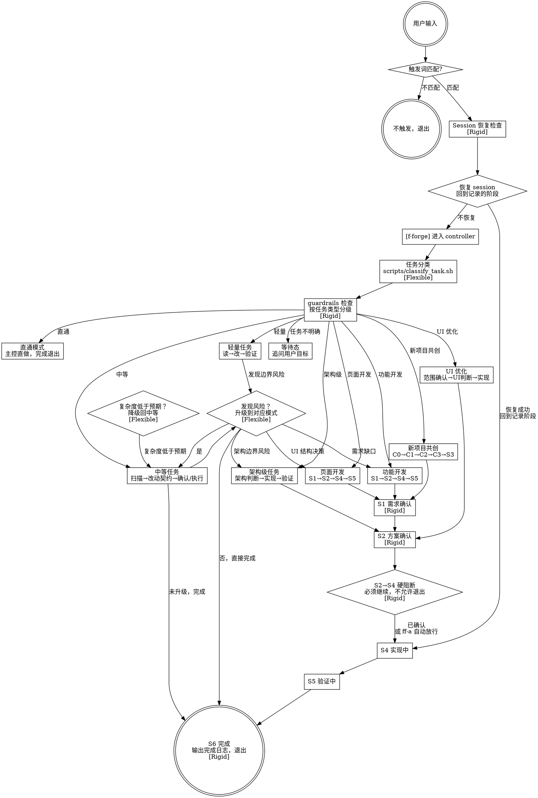
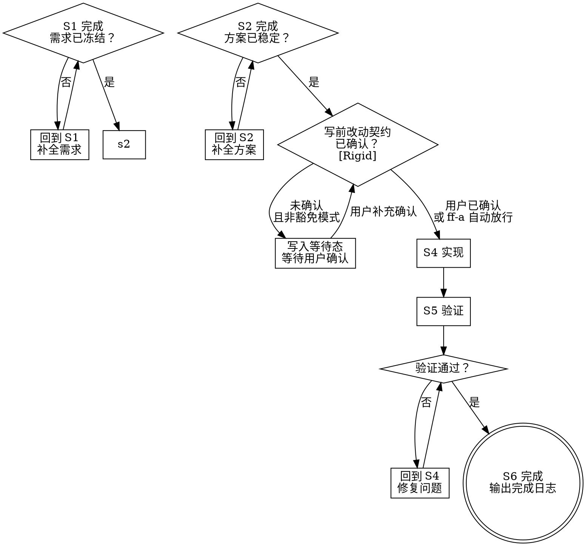
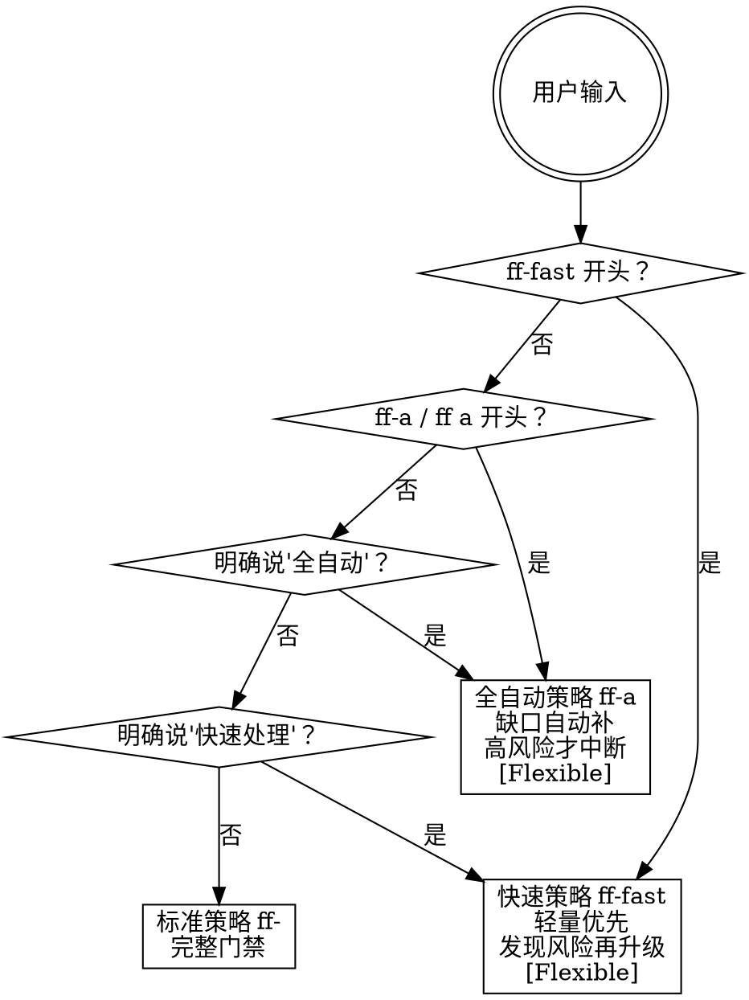

# Forge CLI Reference - 主工作流可视化

本文档包含 forge-cli 主工作流的 digraph 流程图，帮助 agent 快速定位自己在流程中的位置。

## 主工作流

## 阶段门禁流程

## 策略选择流程

## 使用说明

agent 在执行过程中可随时参考本文件判断：
1. 当前在流程图的哪个节点
2. 下一步应该走向哪个分支
3. 是否有 [Rigid] 标注（不可跳过）或 [Flexible] 标注（可适应上下文）
